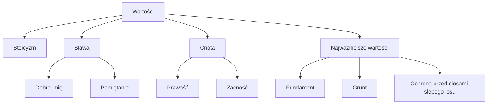

# Język Polski

## Pieśni Jana Kochanowskiego

### Utwory i opracowania
- *Pieśń „Czego chcesz od nas, Panie?...”*
- *Pieśń II z Ksiąg pierwszych*
- *Pieśń XX z Ksiąg pierwszych*
- *Pieśń IX z Ksiąg wtórych*
- *Pieśń XII z Ksiąg wtórych*
- *Pieśń XIV z Ksiąg wtórych*
- *Pieśń Panny XII z Pieśni świętojańskiej o Sobótce*

## Treny Jana Kochanowskiego

### Wartości Kochanowskiego

### Kompozycja cyklu
- *Treny I-II* - przedmowa
- *Treny III-VIII* - wyrazy wzrastającego bólu
- *Treny IX-XI* - zwątpienie
- *Treny XII-XIV* - uzasadnienie zwątpienia
- *Treny XV-XVII* - szukanie ukojenia
- *Treny XIII-XIX* - uspokojenie

### Zadanie
Napisać rozprawkę na temat: *Na czym w Trenie XI polega kryzys światopoglądowy Jana Kochanowskiego i jak jest przedstawiony?*

### Zadanie
Omów uczucia osoby po utracie bliskiej osoby na podstawie *Trenów* Jana Kochanowskiego.

#### Wprowadzenie
Utrata ukochanej osoby to jedno z najtrudniejszych życiowych doświadczeń. Towarzyszą mu gwałtowne emocje uniemożliwiające racjonalne myślenie.

#### Teza
Reakcją na utratę bliskiej osoby jest zazwyczaj bunt i poczucie niesprawiedliwego losu.

#### Argumentacja

##### *Tren I*
- Utwór otwierający cykl pełni funkcję wprowadzenia - ujawnia przyczynę żałoby i nakreśla sytuację podmiotu lirycznego.
- Dominującym uczuciem jest poczucie niesprawiedliwości i nieumiejętność poradzenia sobie z własnymi emocjami.
- Śmierć zostaje porównana do okrutnego smoka zabijającego młodego słowika, co podkreśla jej niesprawiedliwość.
- Reakcją żałobnika jest zakwestionowanie porządku świata. Życie ludzkie zostaje nazwane „błędem”, pułapkę bez wyjścia (*„ono wszędy ciśnie”*)
- Stan buntu i niepewności podkreślają zamykające utwór pytanie retoryczne - żałobnik nie wie, co robić, by zaznać ulgi w cierpieniu.

##### *Tren IX*
- Postawa buntu pogłębia się w dalszych częściach cyklu, osiągając apogeum w *Trenach IX, X, XI*.
- W *Trenie IX* widzimy, że żałoba po utracie bliskiwj osoby potrafi zachwiać całym systemem wartości człowieka - podmiot liryczny drwi z ideałów stoickich, którym hołdował przez całe życie.
- Stoicka mądrość i zalecenie zachowania złotego środka okazują się nieadekwatne w obliczu prawdziwego cierpienia.
- Utrata wartości spowodowana żałobą prowadzi do zakwestionowania sensu życia.

#### Wniosek
Bunt i gniew są naturalnymi reakcjami na utratę bliskiej osoby, etapem procesu żałoby. Zdolność przekucia ich w mądrość życiową pozwala żyć dalej (proces ten widzimy w dalszych trenach Kochanowskiego), natomiast zasklepienie się w nich przekreśla możliwość powrotu do relacji z ludźmi.

### Zadanie
Zinterpretować, a następnie stworzyć prezentację w PowerPoint-cie o podanym trenie.

| Rząd po lewej | Rząd środkowy | Rząd po prawej |
| :-----------: | :-----------: | :------------: |
| *Tren XVII*   | *Tren XVIII*  | *Tren XIX*     |

#### Rozwiązanie
| *Tren XVII* | *Tren XVIII* | *Tren XIX* |
| :---------: | :----------: | :--------: |
